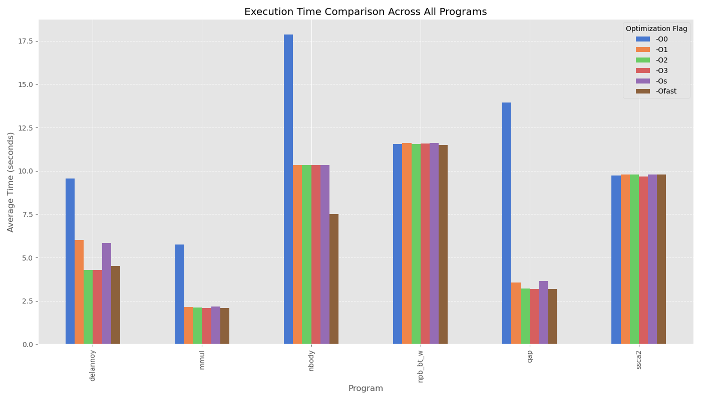

A) Basic Optimization Levels
----------------------------

- For all the graphs see results_a folder.

## Discusion
- For delannoy: Further optimizations (-O3, -Ofast) don't improve performance beyond -O2
- For mmul: It already sees performance improvements with -O1, the other flags do not show any further improvements
- For nbody: Mostly the same as with mmul but further improvements are seen when compiled with -Ofast.
- For npb: Almost no performance difference between optimization levels
- For qap: Almost consisted performance accorss all optimization levels, but -O0
- For ssca2: Same as with npb, no performance difference between optimization levels
- Like expexted -O0 has the worst performance(With some exceptions for npb and ssca2).
- npb and ssca2 did not really get any performance improvements when run with optimizations flags(They are probably already optimized in the source code).

B) Individual Compiler Optimizations
------------------------------------

- Flag analysis summary:
    - fversion-loops-for-strides: appeared in top flags for 4 programs
    - fvect-cost-model=dynamic: appeared in top flags for 4 programs
    - ftree-partial-pre: appeared in top flags for 4 programs
    - fsplit-loops: appeared in top flags for 4 programs
    - fipa-cp-clone: appeared in top flags for 4 programs
    - funswitch-loops: appeared in top flags for 3 programs
    - ftree-loop-distribution: appeared in top flags for 3 programs
    - fsplit-paths: appeared in top flags for 3 programs
    - fpredictive-commoning: appeared in top flags for 3 programs
    - fpeel-loops: appeared in top flags for 3 programs
    - floop-unroll-and-jam: appeared in top flags for 3 programs
    - floop-interchange: appeared in top flags for 3 programs
    - fgcse-after-reload: appeared in top flags for 3 programs

C) Autotuning (optional)
------------------------