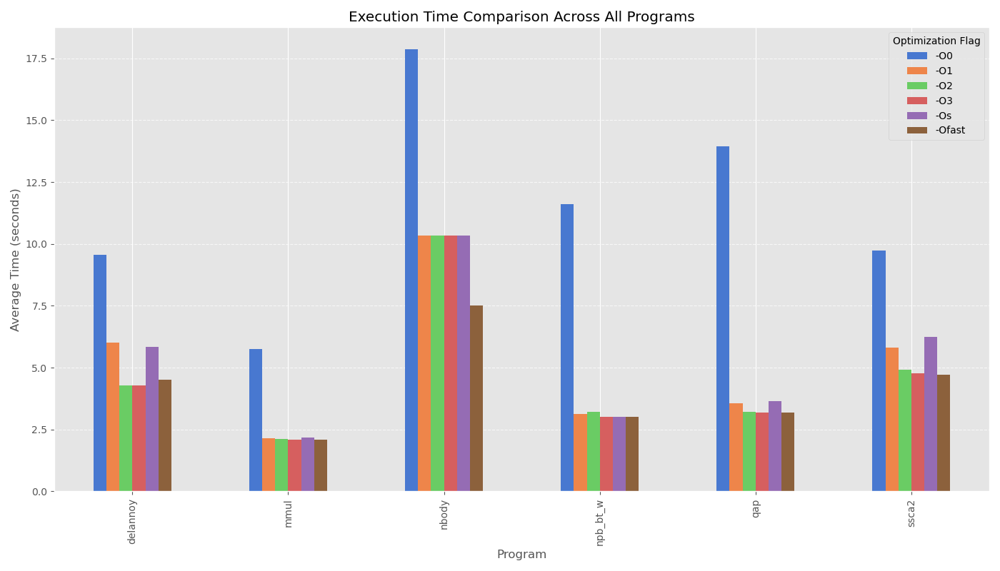
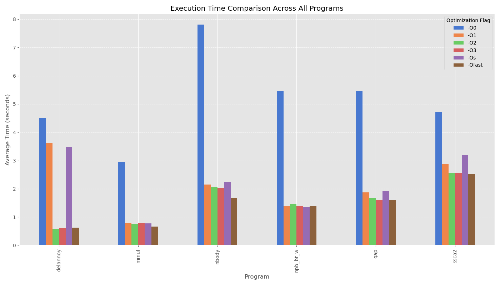
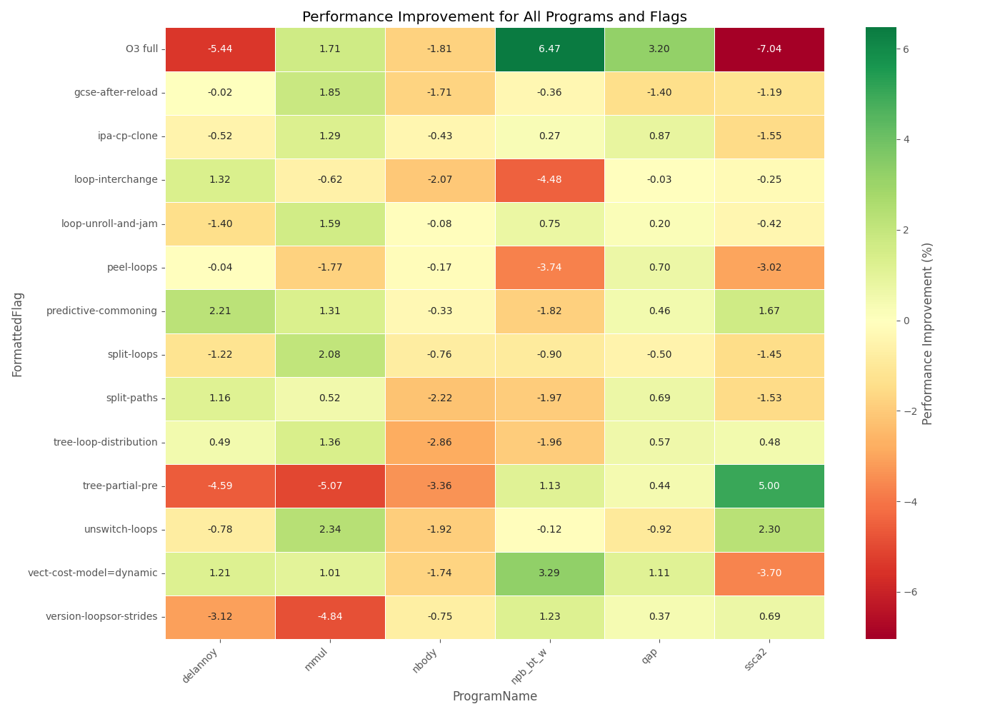

A) Basic Optimization Levels
----------------------------
## Cluster

## Local

- For all the graphs see results_a folder.

## Discusion
- For delannoy: -O2, -O3, and -Ofast are almost the same. -O1, and -Os are the same.
- For mmul: It already sees performance improvements with -O1, the other flags do not show any further improvements, maybe some improvements with -Ofast and -O3
- For nbody: Has significant improvements with -Ofast
- For npb: Almost consisted performance across all optimization levels, but -O0.
- For qap: Almost consisted performance across all optimization levels, but -O0. A bit worse performance with -O1, and -Os.
- For ssca2: Similar to delannoy
- Like expected -O0 has the worst performance.


B) Individual Compiler Optimizations
------------------------------------
- This task was done on my local system for time saving reason 
- Flag analysis summary:
    - -fvect-cost-model=dynamic: appeared in top flags for 4 programs
    - -ftree-loop-distribution: appeared in top flags for 4 programs
    - -fpredictive-commoning: appeared in top flags for 4 programs
    - -fversion-loops-for-strides: appeared in top flags for 3 programs
    - -ftree-partial-pre: appeared in top flags for 3 programs
    - -fsplit-paths: appeared in top flags for 3 programs
    - -floop-unroll-and-jam: appeared in top flags for 3 programs
    - -fipa-cp-clone: appeared in top flags for 3 programs
    - -funswitch-loops: appeared in top flags for 2 programs
    - -fsplit-loops: appeared in top flags for 1 programs
    - -fpeel-loops: appeared in top flags for 1 programs
    - -floop-interchange: appeared in top flags for 1 programs
    - -fgcse-after-reload: appeared in top flags for 1 programs




[Optimize-Options](https://gcc.gnu.org/onlinedocs/gcc/Optimize-Options.html)
### delannoy

- -fpredictive-commoning
- -floop-interchange
- -fvect-cost-model=dynamic

### mmul

- -funswitch-loops
- -fsplit-loops
- -fgcse-after-reload


### nbody

- All the flags worsen the time when applied. It can also be seen on result_a cluster where the runtime is the same between -O3, and -O2.


### npb

- -fvect-cost-model=dynamic
- -fversion-loops-for-strides
- -ftree-partial-pre

### qap

- -fvect-cost-model=dynamic
- -jpa-cp-clone
- -peel-loops

### ssca2

- -tree-partial-pre
- -unswitch-loops
- -predictive-commoning

### Flags Meaning

#### -fpredictive-commoning
Perform predictive commoning optimization, i.e., reusing computations (especially memory loads and stores) performed in previous iterations of loops. 
#### -floop-interchange
Perform loop interchange outside of graphite. This flag can improve cache performance on loop nest and allow further loop optimizations, like vectorization, to take place.
```c
for (int i = 0; i < N; i++)
  for (int j = 0; j < N; j++)
    for (int k = 0; k < N; k++)
      c[i][j] = c[i][j] + a[i][k]*b[k][j];
```
to 
```c
for (int i = 0; i < N; i++)
  for (int k = 0; k < N; k++)
    for (int j = 0; j < N; j++)
      c[i][j] = c[i][j] + a[i][k]*b[k][j];
```
#### -fvect-cost-model=dynamic
With the ‘dynamic’ model a runtime check guards the vectorized code-path to enable it only for iteration counts that will likely execute faster than when executing the original scalar loop.
#### -fsplit-loops
Split a loop into two if it contains a condition that’s always true for one side of the iteration space and false for the other. 
#### -fversion-loops-for-strides
If a loop iterates over an array with a variable stride, create another version of the loop that assumes the stride is always one. 
```c
for (int i = 0; i < n; ++i)
  x[i * stride] = …;
```
to
```c
if (stride == 1)
  for (int i = 0; i < n; ++i)
    x[i] = …;
else
  for (int i = 0; i < n; ++i)
    x[i * stride] = …;
```
#### -funswitch-loops
Move branches with loop invariant conditions out of the loop, with duplicates of the loop on both branches (modified according to result of the condition). 
#### -fgcse-after-reload
When -fgcse-after-reload is enabled, a redundant load elimination pass is performed after reload. The purpose of this pass is to clean up redundant spilling. 
#### -ftree-partial-pre
Make partial redundancy elimination (PRE) more aggressive
#### -fipa-cp-clone
Perform function cloning to make interprocedural constant propagation stronger. When enabled, interprocedural constant propagation performs function cloning when externally visible function can be called with constant arguments. Because this optimization can create multiple copies of functions, it may significantly increase code size.
#### -fpeel-loops
Peels loops for which there is enough information that they do not roll much (from profile feedback or static analysis). It also turns on complete loop peeling (i.e. complete removal of loops with small constant number of iterations).

### What are the Insights

- Matrix and numerical computations (mmul, delannoy) benefit most from loop transformations and redundancy elimination
- Graph algorithms (ssca2) show dramatic improvements with partial redundancy elimination
- Complex simulations (npb, qap) respond well to dynamic vectorization strategies
- For some programs like nbody, individual optimizations can actually degrade performance compared to the balanced approach of -O3


C) Autotuning (optional)
------------------------