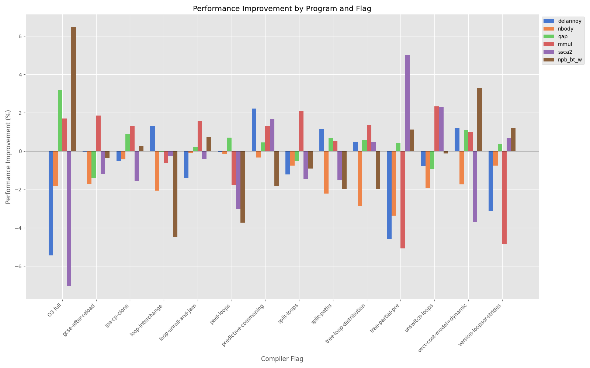

A) Basic Optimization Levels
----------------------------
## Cluster

## Local

- For all the graphs see results_a folder.

## Discusion
- For delannoy: -O2, -O3, and -Ofast are almost the same. -O1, and -Os are the same.
- For mmul: It already sees performance improvements with -O1, the other flags do not show any further improvements, maybe some improvements with -Ofast and -O3
- For nbody: Has significant improvements with -Ofast
- For npb: Almost consisted performance across all optimization levels, but -O0.
- For qap: Almost consisted performance across all optimization levels, but -O0. A bit worse performance with -O1, and -Os.
- For ssca2: Similar to delannoy
- Like expected -O0 has the worst performance.


B) Individual Compiler Optimizations
------------------------------------
- This task was done on my local system for time saving reason 
- Flag analysis summary:
    - -fvect-cost-model=dynamic: appeared in top flags for 4 programs
    - -ftree-loop-distribution: appeared in top flags for 4 programs
    - -fpredictive-commoning: appeared in top flags for 4 programs
    - -fversion-loops-for-strides: appeared in top flags for 3 programs
    - -ftree-partial-pre: appeared in top flags for 3 programs
    - -fsplit-paths: appeared in top flags for 3 programs
    - -floop-unroll-and-jam: appeared in top flags for 3 programs
    - -fipa-cp-clone: appeared in top flags for 3 programs
    - -funswitch-loops: appeared in top flags for 2 programs
    - -fsplit-loops: appeared in top flags for 1 programs
    - -fpeel-loops: appeared in top flags for 1 programs
    - -floop-interchange: appeared in top flags for 1 programs
    - -fgcse-after-reload: appeared in top flags for 1 programs




## Top 3 Most Impactful Options Across All Test Cases
- -fversion-loops-for-strides (2.93% average improvement)
- -fipa-cp-clone (2.32% average improvement)
- -fvect-cost-model=dynamic (2.12% average improvement)

[Optimize-Options](https://gcc.gnu.org/onlinedocs/gcc/Optimize-Options.html)
### -fversion-loops-for-strides
If a loop iterates over an array with a variable stride, create another version of the loop that assumes the stride is always one. 

```c
for (int i = 0; i < n; ++i)
  x[i * stride] = …;
```
to 

```c	
if (stride == 1)
  for (int i = 0; i < n; ++i)
    x[i] = …;
else
  for (int i = 0; i < n; ++i)
    x[i * stride] = …;
```

### -fipa-cp-clone

Perform function cloning to make interprocedural constant propagation stronger. When enabled, interprocedural constant propagation performs function cloning when externally visible function can be called with constant arguments. Because this optimization can create multiple copies of functions, it may significantly increase code size (see --param ipa-cp-unit-growth=value).

### -fvect-cost-model=dynamic

With the ‘dynamic’ model a runtime check guards the vectorized code-path to enable it only for iteration counts that will likely execute faster than when executing the original scalar loop.


C) Autotuning (optional)
------------------------