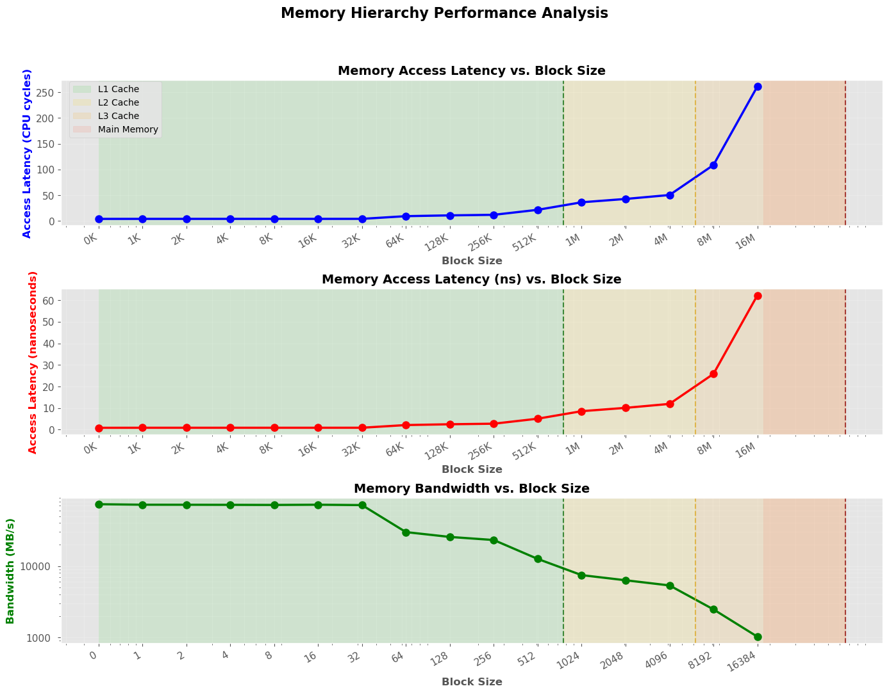
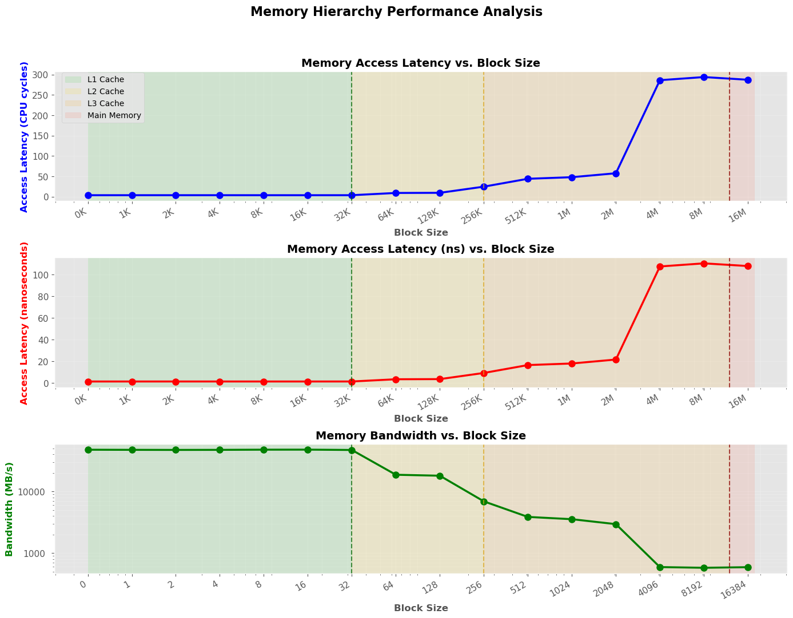

Exercise Sheet 6
================

A) MMUL tiling
--------------

Top image shows the performance of my local machine, while the bottom image shows the performance of the cluster.  
Interestingly, on my local machine, the performance is declining with increasing block size, while on the cluster, the performance stays more or less constant until the block size reaches 1024, after which it starts to decline dramatically.  
Some possible reasons for this could be that the local machine the smallest block size(8) still fittes in the L1 cache, while on the cluster, it does not. So on the cluster, the performance is limited by the L2 cache, while on the local machine, we can still benefit from the L1 cache.    

B) Cache investigation and C) Cache benchmark
----------------------

The cache investigation shows the performance of the local machine on the top and the cluster on the bottom.
On those images, we can more or less clearly see the cache hierarchy of the machines.

## How it works
- Random Chase Array Creation:
  - Creates an array of cache-line-sized nodes (64 bytes)
  - Randomizes the order of node traversal to defeat hardware prefetchers
  - Each node points to another node, creating a linked list with unpredictable access patterns
  - Fisher-Yates shuffle algorithm
    - Each position has an equal probability of receiving any element
    - The shuffle is unbiased

Submission
----------
Please submit your solutions by email to peter.thoman at UIBK, using the string "[Perf2025-sheet6]" in the subject line, before the start of the next VU at the latest.  
Try not to include attachments with a total size larger than 2 MiB.
