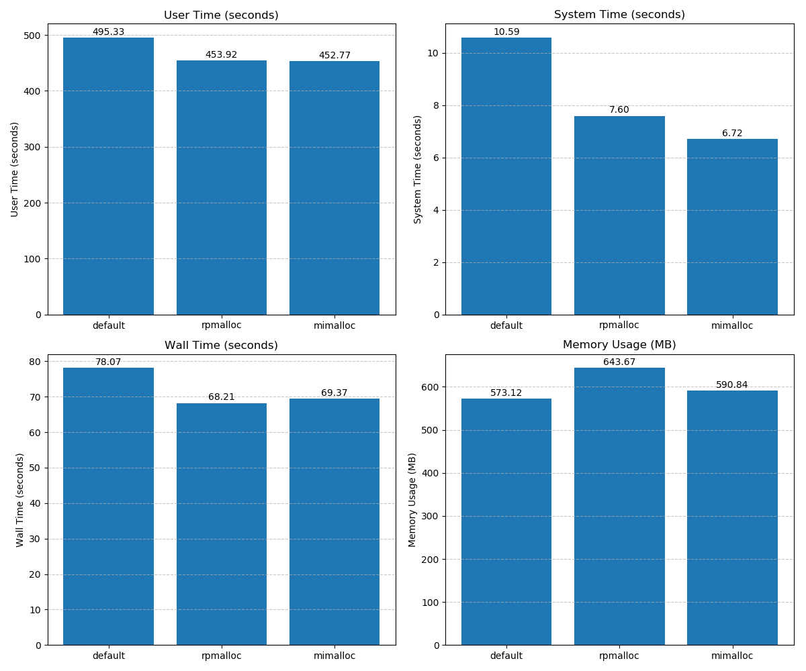
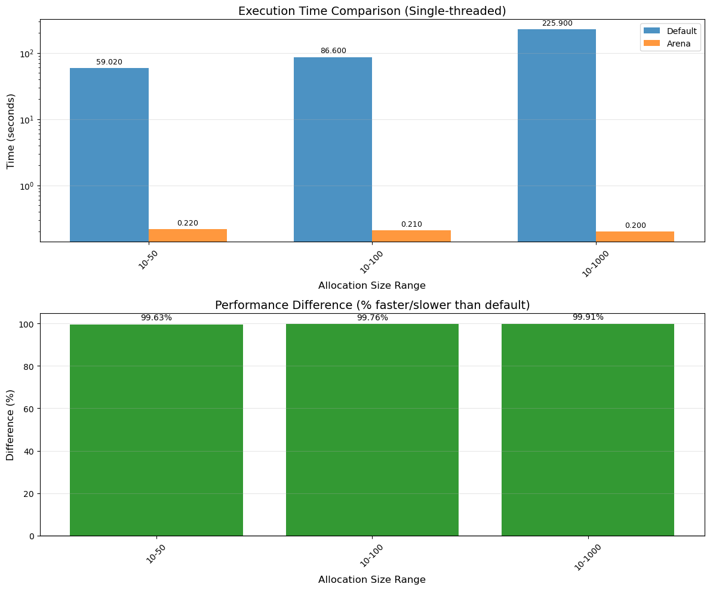
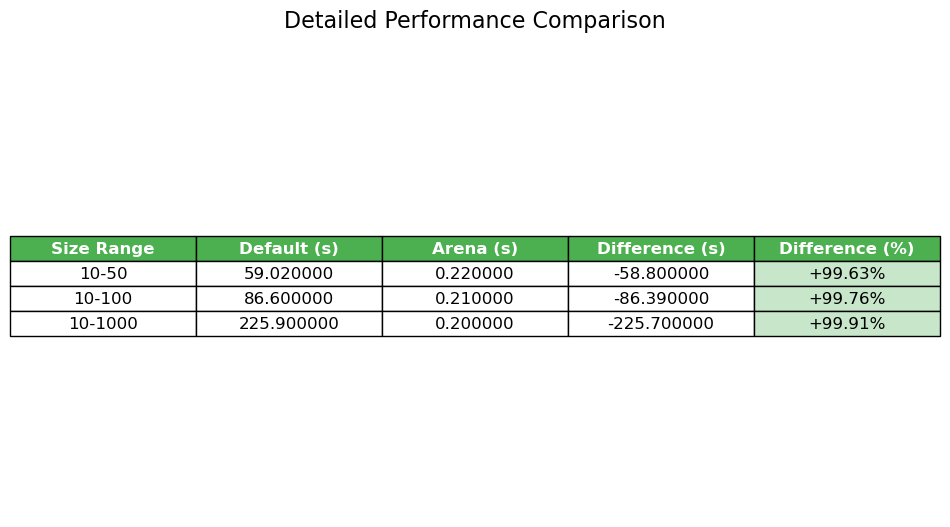

A) Preloading General Allocators
--------------------------------
Perform 3 sets of benchmarks:

1. No allocator preloading
```
    Command being timed: "ninja"  
    User time (seconds): 495.33  
    System time (seconds): 10.59  
    Percent of CPU this job got: 648%  
    Elapsed (wall clock) time (h:mm:ss or m:ss): 1:18.07  
    Average shared text size (kbytes): 0  
    Average unshared data size (kbytes): 0  
    Average stack size (kbytes): 0  
    Average total size (kbytes): 0  
    Maximum resident set size (kbytes): 586876  
    Average resident set size (kbytes): 0  
    Major (requiring I/O) page faults: 257  
    Minor (reclaiming a frame) page faults: 1832485  
    Voluntary context switches: 4575  
    Involuntary context switches: 7665  
    Swaps: 0  
    File system inputs: 136  
    File system outputs: 126816  
    Socket messages sent: 0  
    Socket messages received: 0  
    Signals delivered: 0  
    Page size (bytes): 4096  
    Exit status: 0  
```
2. Preloading the RPMalloc allocator
```
	Command being timed: "ninja"
	User time (seconds): 453.92
	System time (seconds): 7.60
	Percent of CPU this job got: 676%
	Elapsed (wall clock) time (h:mm:ss or m:ss): 1:08.21
	Average shared text size (kbytes): 0
	Average unshared data size (kbytes): 0
	Average stack size (kbytes): 0
	Average total size (kbytes): 0
	Maximum resident set size (kbytes): 659120
	Average resident set size (kbytes): 0
	Major (requiring I/O) page faults: 106
	Minor (reclaiming a frame) page faults: 325331
	Voluntary context switches: 3716
	Involuntary context switches: 6226
	Swaps: 0
	File system inputs: 0
	File system outputs: 107104
	Socket messages sent: 0
	Socket messages received: 0
	Signals delivered: 0
	Page size (bytes): 4096
	Exit status: 0
``` 
3. Preloading the MiMalloc allocator  
```
	Command being timed: "ninja"
	User time (seconds): 452.77
	System time (seconds): 6.72
	Percent of CPU this job got: 662%
	Elapsed (wall clock) time (h:mm:ss or m:ss): 1:09.37
	Average shared text size (kbytes): 0
	Average unshared data size (kbytes): 0
	Average stack size (kbytes): 0
	Average total size (kbytes): 0
	Maximum resident set size (kbytes): 605024
	Average resident set size (kbytes): 0
	Major (requiring I/O) page faults: 98
	Minor (reclaiming a frame) page faults: 638271
	Voluntary context switches: 4016
	Involuntary context switches: 7106
	Swaps: 0
	File system inputs: 0
	File system outputs: 107112
	Socket messages sent: 0
	Socket messages received: 0
	Signals delivered: 0
	Page size (bytes): 4096
	Exit status: 0
```

```
Performance Comparison Report
============================

Allocator    User Time (s)   System Time (s)  Wall Time (s)   Memory (MB) 
----------------------------------------------------------------------
default      495.33          10.59            78.07           573.12      
rpmalloc     453.92          7.60             68.21           643.67      
mimalloc     452.77          6.72             69.37           590.84      

Performance Improvements (compared to default allocator)
===================================================

Allocator    User Time (%)   System Time (%)  Wall Time (%)   Memory (%)  
----------------------------------------------------------------------
rpmalloc     8.36            28.23            12.63           -12.31      
mimalloc     8.59            36.54            11.14           -3.09       
````
Here we see a trade-off: both specialized allocators consume more memory, with RPMalloc using significantly more than MiMalloc. This suggests that these allocators trade some memory overhead for speed improvements.


B) Implementing a special-purpose allocator
-------------------------------------------



```
Threads         Size Range      Time Speedup    Default (s)     Arena (s)       Default (MB)    Arena (MB)     
---------------------------------------------------------------------------------------------------------
1               10-50           1.00            59.110000       59.060000       51.98           51.95          
1               10-100          1.00            86.460000       86.250000       75.56           75.47          
1               10-1000         1.01            229.470000      227.500000      504.79          504.82   
```
The custom arean+bump allocator only shows modest performance improvements over the default allocator.
It seems the default allocator is already quite efficient for this test case, and the custom allocator does not provide significant advantages in terms of speed or memory usage.(Memory usage is more or less the same for both) 
