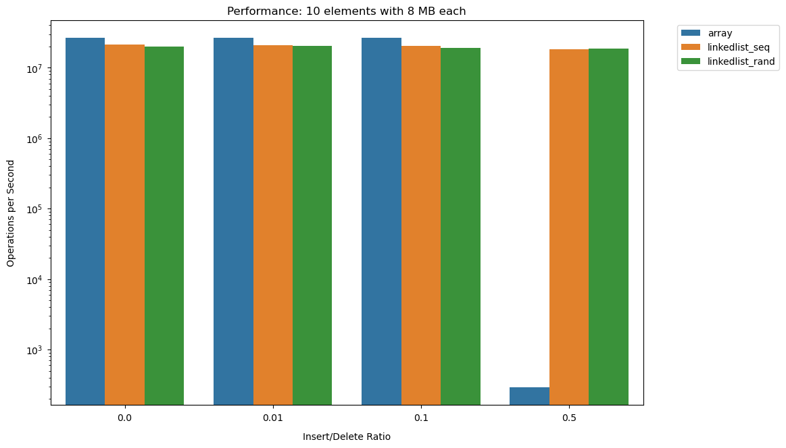
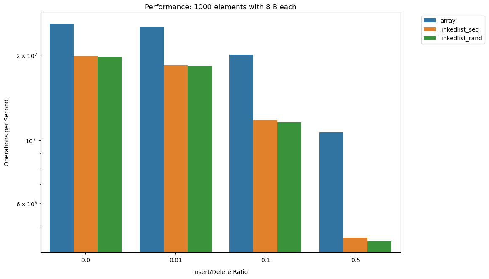
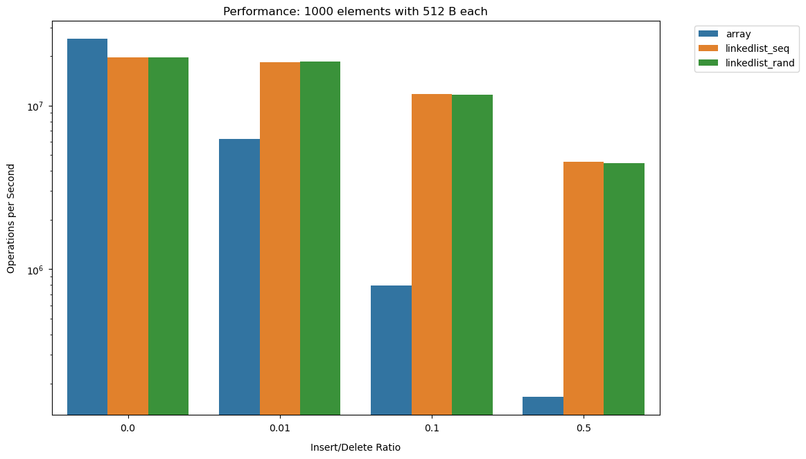
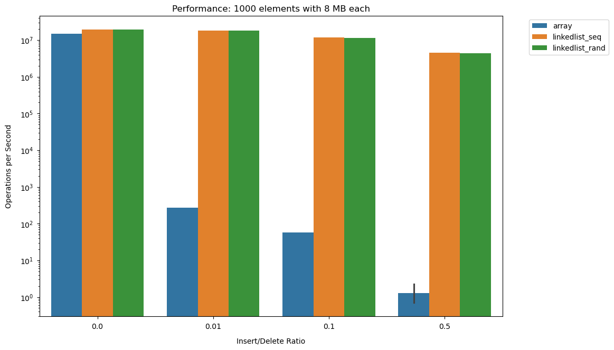
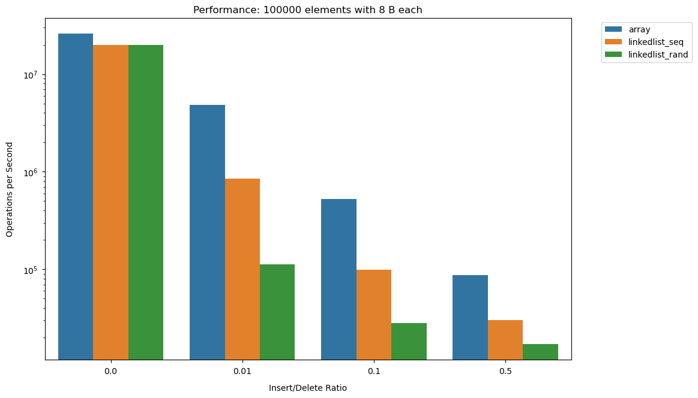
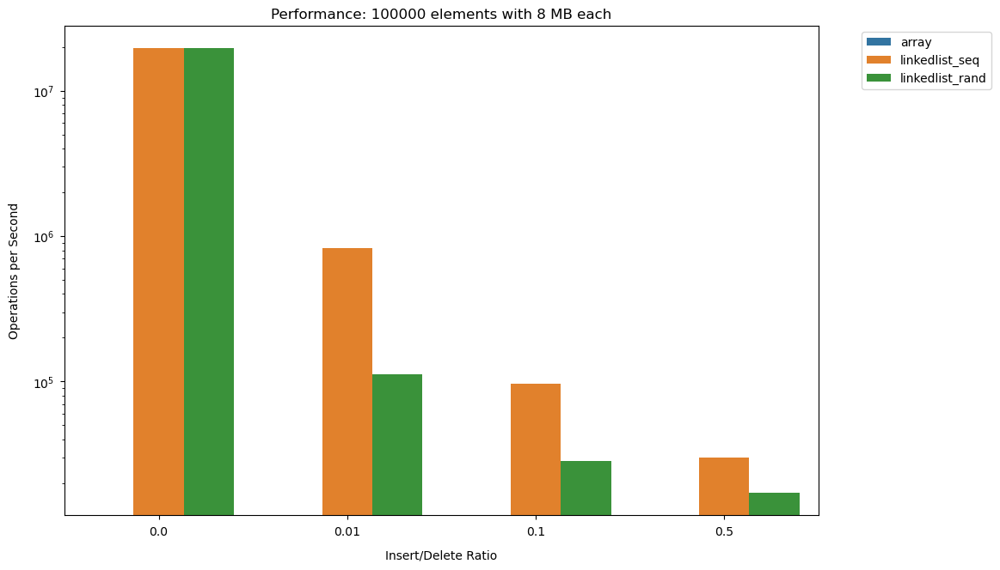
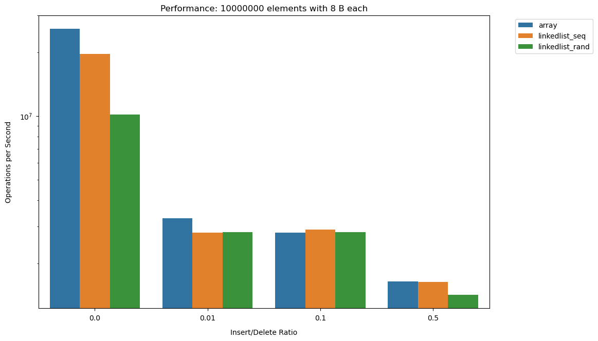

# Performance Comparison Plots

### Data Size: 10

**Cluster (8 parameters):**


**Cluster (512 parameters):**


**Cluster (8,388,608 parameters):**


### Data Size: 1,000

**Cluster (8 parameters):**


**Cluster (512 parameters):**


**Cluster (8,388,608 parameters):**


### Data Size: 100,000

**Cluster (8 parameters):**


**Cluster (512 parameters):**


**Cluster (8,388,608 parameters):**


### Data Size: 10,000,000

**Cluster (8 parameters):**


**Cluster (512 parameters):**


**Cluster (8,388,608 parameters):**


## Key Observations

### Data Structure Performance Varies by Element Size

1. **For small elements (8 B)**:
   - With small datasets (10-1,000 elements), arrays significantly outperform linked lists
   - Arrays achieve ~27 million ops/sec for 10 elements, while linked lists reach ~20 million ops/sec
   - This advantage is due to arrays' cache locality and direct memory access

2. **For medium elements (512 B)**:
   - Performance relationships begin to shift
   - Arrays still perform well with very small datasets (10 elements)
   - As data size increases to 1,000+ elements, linked lists start outperforming arrays
   - With 100,000+ elements, arrays perform poorly (~900 ops/sec) while linked lists maintain higher throughput

3. **For large elements (8 MB)**:
   - Linked lists dramatically outperform arrays across all dataset sizes
   - Arrays show extremely poor performance (~600 ops/sec for 10 elements, barely visible in larger datasets)
   - Both sequential and random linked lists maintain high throughput (~10-15 million ops/sec)

### Impact of Dataset Size

- As dataset size increases from 10 to 10,000,000 elements:
  - Array performance degrades significantly, especially with larger elements, and for some reason at the lager dataset sizes and larger element sizes the array even failed to run at all.
  ```
    Testing: array, 10000000 elements, 8388608B, 0.00 ins/del ratio
    Error: Failed to allocate 83886088388608 bytes for array
    Error: Could not extract result
    Testing: array, 10000000 elements, 8388608B, 0.01 ins/del ratio
    Error: Failed to allocate 83886088388608 bytes for array
    Error: Could not extract result
    Testing: array, 10000000 elements, 8388608B, 0.10 ins/del ratio
    Error: Failed to allocate 83886088388608 bytes for array
    Error: Could not extract result
    Testing: array, 10000000 elements, 8388608B, 0.50 ins/del ratio
    Error: Failed to allocate 83886088388608 bytes for array
    Error: Could not extract result
    ```
  - The performance gap between arrays and linked lists widens
  - For 10,000,000 elements, linked lists outperform arrays regardless of element size

### Sequential vs. Random Access

- Sequential linked lists (linkedlist_seq) consistently outperform random access linked lists (linkedlist_rand)
- This difference becomes more pronounced with larger datasets
- For 100,000+ elements, sequential access provides significant benefits due to better cache utilization

### Insert/Delete Ratio Effects

- The impact of different insert/delete ratios (0.0, 0.01, 0.1, 0.5) is relatively minor compared to data structure choice
- Higher insert/delete ratios occasionally cause slight performance degradation, particularly for random linked lists
- For arrays, performance remains relatively stable across different ratios

## Why These Patterns Occur

1. **Memory allocation constraints**: 
   - Arrays require contiguous memory blocks, which become difficult to allocate for large elements or large datasets
   - Linked lists allocate nodes individually, avoiding this limitation

2. **Cache effects**:
   - Arrays benefit from spatial locality with small elements, allowing efficient cache utilization
   - As element size increases, this advantage disappears
   - Sequential linked list traversal creates predictable memory access patterns that modern CPUs can prefetch

3. **Memory fragmentation**:
   - With large elements or datasets, memory fragmentation impacts array performance severely
   - Linked lists are more resilient to fragmentation

4. **Memory hierarchy**:
   - Performance differences reflect interactions between CPU caches, main memory, and virtual memory systems
   - Arrays perform best when data fits in cache
   - Linked lists perform better when data must be fetched from main memory