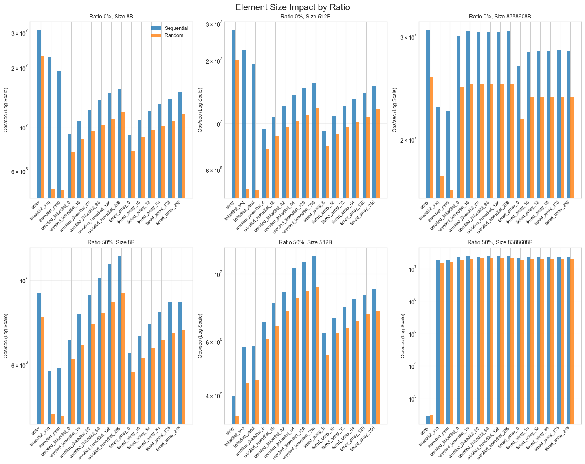
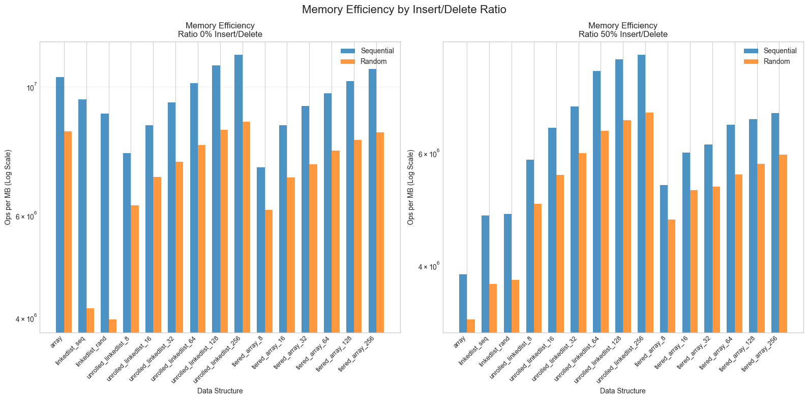
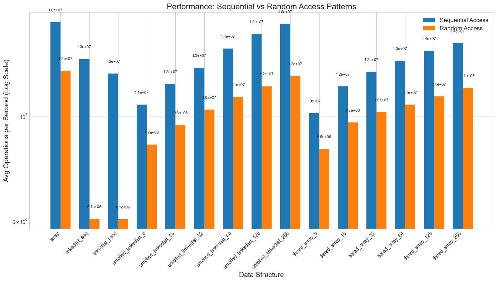
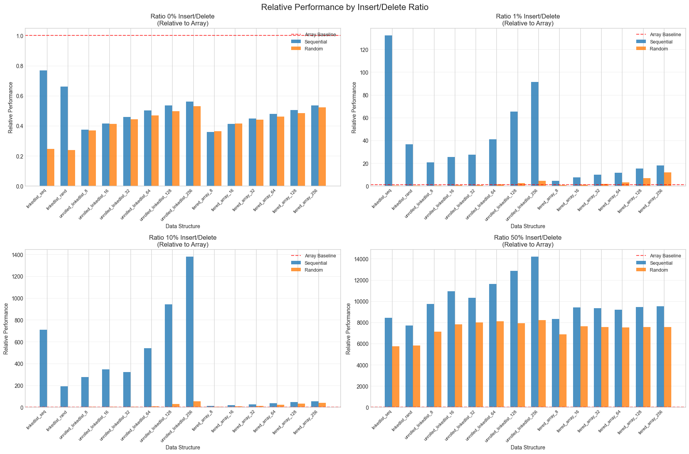

# Data Structure Performance Analysis

## Analysis Components

### Access Pattern Performance

**Description**: Compares performance across four insert/delete ratios (0%, 1%, 10%, 50%) showing operations per second on logarithmic scale.

**Key Insights**:
- Sequential access consistently outperforms random access
- Performance degrades with higher insert/delete ratios
- Different data structures(chunk sizes) show varying sensitivity to modification patterns

### Data Size Impact

**Description**: Examines how performance scales with data size (10 to 1,000,000 elements).

**Key Insights**:
- Sequential access maintains advantage across all sizes
- Some structures show better scaling characteristics

### Element Size Impact

**Description**: Analyzes performance with different element sizes (8B, 512B, 838860B) at 0% and 50% modification ratios.

**Key Insights**:
- Larger elements favor sequential access patterns
- Memory bandwidth becomes limiting factor(see 838860B element size)

### Memory Efficiency

**Description**: Shows operations per MB for different modification ratios.

**Key Insights**:
- Memory efficiency varies significantly between structures
- Trade-offs between performance and memory usage(see plot above)

### Sequential vs Random Comparison

**Description**: Direct bar chart comparison of access patterns.

### Relative Performance

**Description**: Performance normalized to array baseline across modification ratios.

**Key Insights**:
- Scenarios where alternatives outperform arrays
- Performance multipliers for different use cases

### THE LARGE PLOT

#### Element Size vs Number of Elements Ratio 0%

#### Element Size vs Number of Elements Ratio 1%

#### Element Size vs Number of Elements Ratio 10%

#### Element Size vs Number of Elements Ratio 50%

## Key Findings

### 1. Sequential Access Dominance
**Observation**: Sequential access patterns consistently outperform random access across all data structures and experimental conditions.

**Magnitude**: 2-10x performance advantage in most scenarios, reaching 100x+ for large datasets.

### 2. Modification Ratio Sensitivity
**Linear Degradation**: Most structures show predictable performance decline as insert/delete ratio increases from 0% to 50%.(The normal array is a bit outlier here, showing a more pronounced degradation.)

**Structure Resilience**: Unrolled linked lists and tiered arrays demonstrate better stability under dynamic conditions compared to basic arrays.

**Critical Threshold**: Performance degradation accelerates beyond 10% modification ratio for most structures.

### 3. Size-Dependent Performance Characteristics
**Small Data (≤1,000 elements)**: Structure overhead dominates, arrays maintain advantage.

**Medium Data (1,000-100,000 elements)**: Cache effects become significant, unrolled structures gain advantage.

**Large Data (≥100,000 elements)**: Memory hierarchy effects dominate, sequential access becomes critical.

---