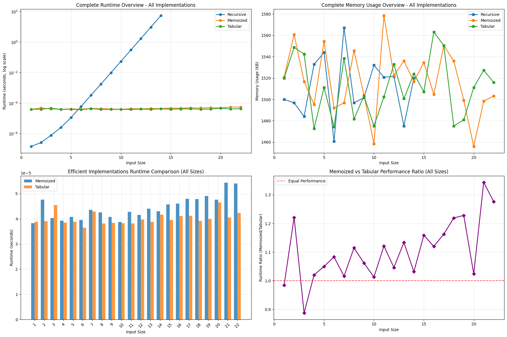
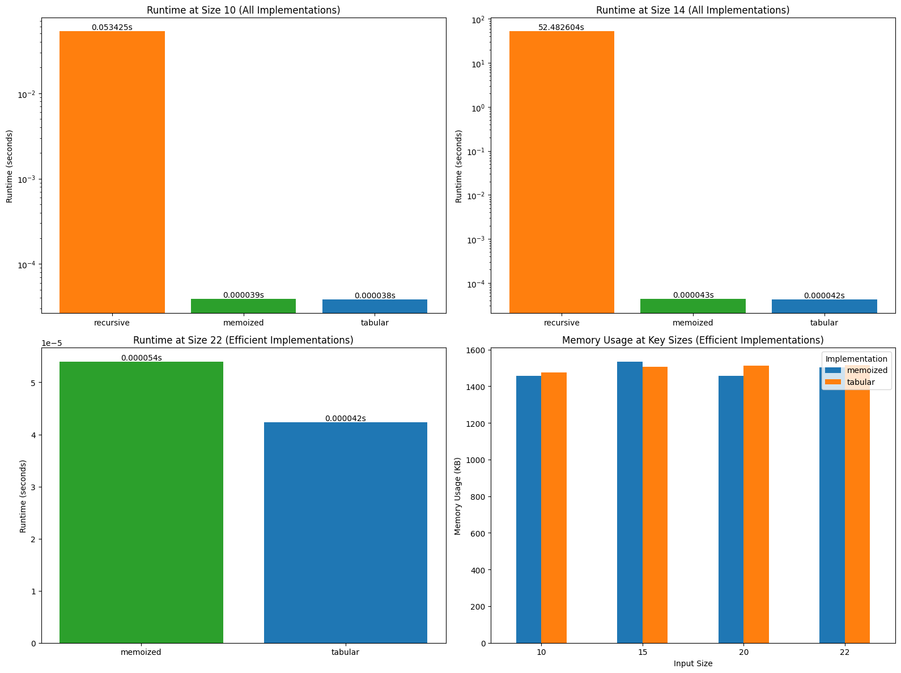
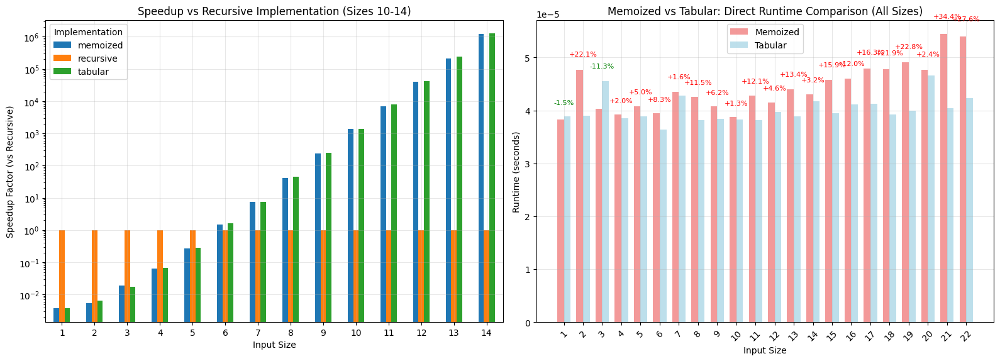

Exercise Sheet 11
=================

A) Applying Memoization (optional)
----------------------------------

 * What level of performance improvement can you achieve, both theoretically and practically?
    * Theoretically, memoization can reduce the time complexity of the Delannoy function from exponential to polynomial, specifically to O(x * y), where x and y are the parameters of the function. 
    * Practically, the performance improvement will depend on the specific input sizes and the overhead of managing the memoization cache.
 * What is the space complexity of your optimized version in terms of the parameters `x` and `y`?
    * The space complexity of the memoized version is O(x * y) due to the storage of results in a hash table, where each unique pair (x, y) corresponds to a computed value.

B) Algorithm Tabulation (optional)
----------------------------------

Overall the two solutions are equivalent, with the memoization solution being a bit faster than the tabulation solution. 

Sadly this algorithm does not require a lot of memory to run, so the "memory" benefit of only storing O(n) values is not really visible in practice. 

Overall both solutions are much faster than the recursive solution.

