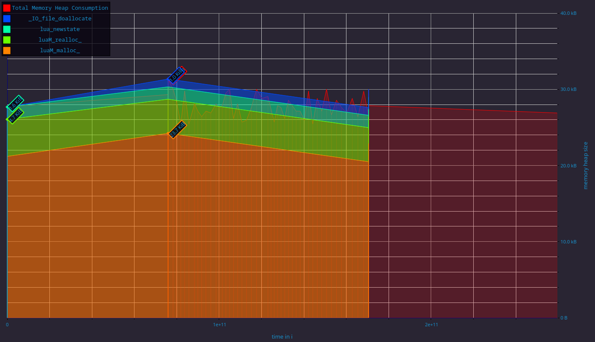
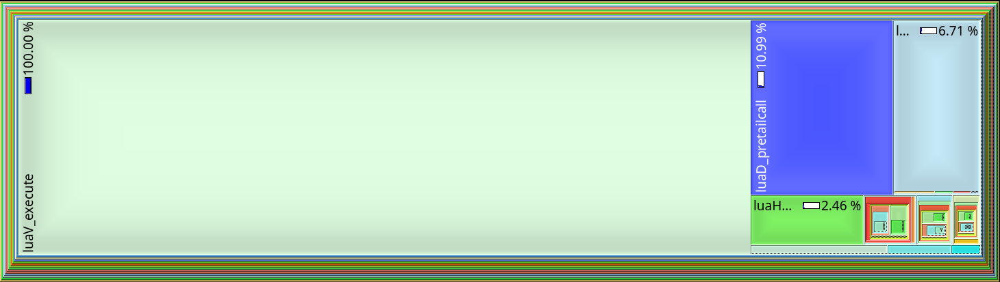
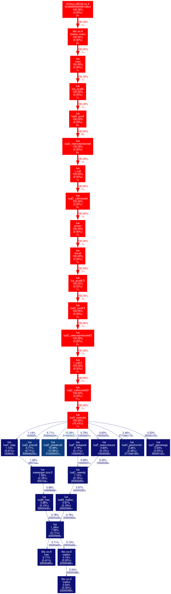

# Profiling the Lua Interpreter on LCC3

## Overview

This short report summarizes profiling results for the Lua interpreter on the LCC3. The profiling was conducted using four tools: `perf`, `gprof`, `massif`, and `callgrind`. The goal was to evaluate performance characteristics and identify potential optimization opportunities.

## Setup

- **Platform**: LCC3
- **Interpreter**: Lua-5.4.7
- **Compilation**:
  - `perf` and `gprof`: Compiled with `-O2` and `-O3`
  - `massif` and `callgrind`: Compiled with `-O3`
- **Workload**: fib.lua

## Tools & Results

### `perf`

- **Findings**:
  - Cache misses were minimal, indicating good locality. The Program is definetly not memory bound.
  - Minor differences between `-O2` and `-O3` optimizations.
  - LLC misses were at ~16% which is to be expected, if the L1 miss rate is ~0%
  - Branch misspredictions were at 1.6% for -O3 and 1.21% for -O2. This may be due to higher control flow complexity. The overall rates are still quite low and unlikely to have a significant impact on performance.

### `gprof`

- **Findings**:
  - Most time spent in `luaV_execute`, with ~80% of the execution time
  - Other expensive functions are luaD_pretailcall(~10%, 310000031 calls), luaD_precall(~5%, 306946254 calls) and luaH_getshortstr(~2%, 271946189 calls) 
  - Function call hierarchy showed minimal overhead in non-core VM functions

### `massif`

- **Findings**:
  - Heap usage peaked during script parsing and loading
  - Majority of allocations linked to `luaM_malloc`, `luaM_realloc_` and `lua_newstate`

### `callgrind`

- **Findings**:
  - Call graph aligned with `gprof` output, reinforcing hotspots in the VM loop

## Conclusion

Profiling indicates that the Lua VM loop (`luaV_execute`) dominates performance, both in execution time and instruction count. Optimization flags (`-O2` vs. `-O3`) had marginal impact on performance-critical sections. Memory usage is efficient but shows spikes during parsing. Further optimizations may require changes to the interpreter design.

Below is the entire Callgraph of the program: 

